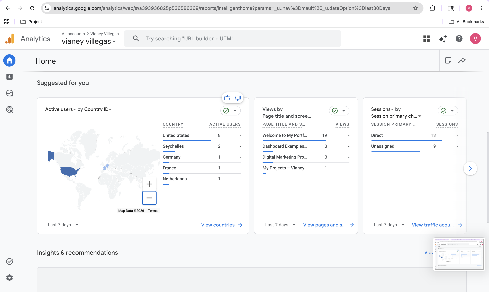
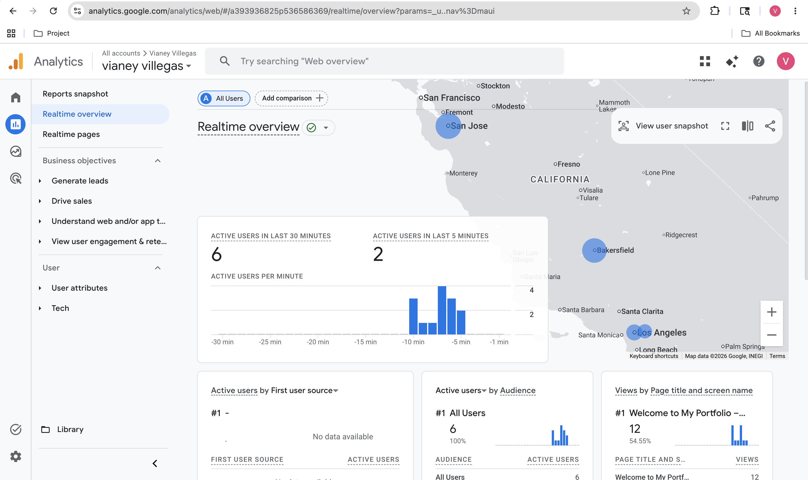
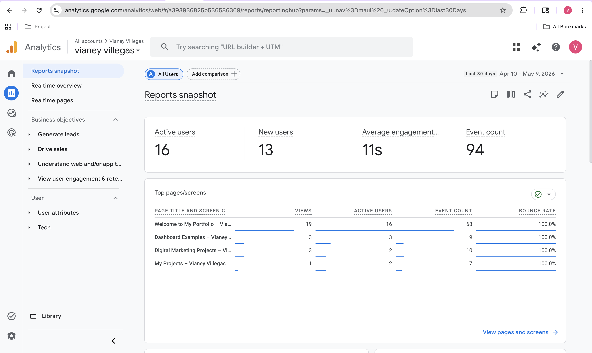

In this project, I learned how to use Google Analytics to understand website traffic, user behavior, and performance data. I learned how analytics can help improve a website by showing where visitors come from, what pages they view, and how they interact with content.

### What I Learned

- How to track website visitors
- How to analyze traffic sources
- How to understand user behavior
- How to read reports and key metrics
- How data helps improve website performance

### Skills I Gained

- Data analysis
- Website performance tracking
- Understanding user engagement
- Reading analytics reports
- Making decisions using data

## Project Images

